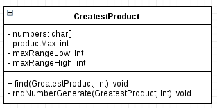
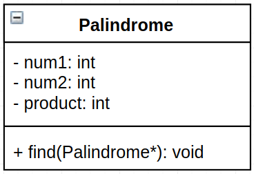

# Shiva_LP_5
This repository contains solution to some computer science problems in most effecient ways I could. It also introduces you to 
**TDD (Test Driven Development)** approach of software development which is well known to minimize bugs and security vulnerabilities.

## Q1. 
The four adjacent digits in the 1000-digit numerals that have the greatest product are 9x9x8x9=5832(for example). Find 
the thirteen adjacent digits in the 1000-digit number that have the greatest product. What is the value of the product?

```c
8878756113405462575236653918726828134778693925674034151
7920137625375876563745112107265430496279395295067699468
9563593119860008704378908986898621070005873283268716687
7498755251383504478363147843493162078644536995056796611
0806555533435454864213320704872729760354066688603887209
5485805490493874794592301832103786710261571321930280217
8598033345524930002157694783127368530220610659786256607
6575139449397052724906681901127595408234785540379464472
4431427152957506002654055044998765906655688168331378025
8190795796296444851914755539057934382177170706812832212
6432331761260710710173710066308289621014771600086722835
6114778194252923577772867965453728107193374989067541585
2320669499225713859402058885967278295238434874442519887
1646676870098501069195635642520262048795344914839300759
4758920106117509827855382635829624391516212247383089673
1070699438944769831283902254560518293705210378714927449
6836773363519307227247419925985214110825417051726020608
4305901433616790722383667731628477257006269721674213129
2430995753135566968510753715438054483624324193763271940
7741909247566403472058645026267523175227666253490715607
```

### Solution
I will be going through the following process to get the expected solution.
#### System Overview/Block diagram


## Q2
A palindromic number reads the same both ways. The largest palindome made from the product of two 2-digit 
number is 9009 = 91 x 99.  
Find the largest palindrome made from the product of two 3-digit numbers.  


## Q3

**Test Case Scenario**  
For application In the division calculator Input 1 and Input 2 is divisor, When clicked on Divide button, it should perform division of two number specified in the two fields and should show result on result box.
